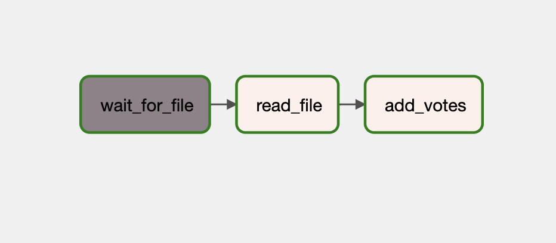
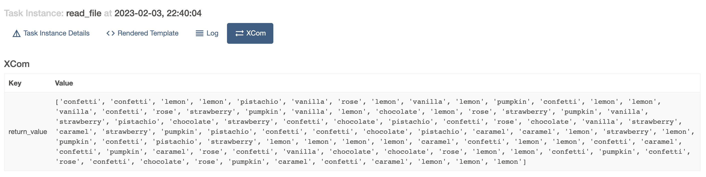
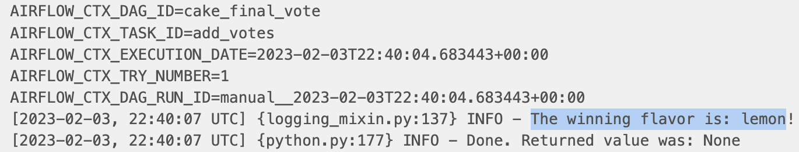

# Code Review: Airflow pt 2

#### By Drew White

#### Code Review - Demonstrating the use of Apache Airflow, continued

## Technologies Used


* Python
* Apache Airflow
* Docker

</br>

## Description:

Your cohort, plus several dozen of your closest friends, want to celebrate learning Airflow. You've all been asked to vote on a cake flavor from the following list:

```
flavors_choices = ["lemon", "vanilla", "chocolate", "pistachio", "strawberry", "confetti", "caramel", "pumpkin", "rose"]
```

With the list above in mind, write a DAG that:

* Uses a file sensor to check whether the `votes.csv` file has been uploaded to the `data/` folder of this repository.
* Uses a file connection `data_fs`. To set this up:
    1. In the Airflow GUI:
    2. Navigate to the Airflow Admin > Connections page
    3. Click the + to add a new Connection
    4. Enter the following information and leave the other fields blank:
    5. ```
         Connection Id = data_fs
         Connection Type = File (path)
         Extra = {"path": "/opt/airflow/data"}
    6. Click Save

* Has a task that reads each row in `votes.csv`, and checks whether that value is in the `flavors_choices` list defined above. If it is, append it to a new list called `valid_votes`. This task should return the `valid_votes` list.

* In another task, use `add_votes` Python function that takes a list as an argument, and prints the item that appears the most times in that list.

* Pass the `return_value` XCom from the first task as an argument to the second task.

* Uses decorators to define the tasks.

_Task structure:_  
 

_XCom:_ 
 

_Result:_ 
 
_The winner is lemon!_ 
<br>

## Setup/Installation Requirements

* Clone by inputting following into terminal: 
  ```bash
  git clone https://github.com/Drewrwhite/data_week_12.git
  ```
* Navigate to directory:
  ```bash
  cd <directory>
  ```
* Create a virtual environment:
  ```bash
  python3.7 -m venv venv
  ```
* Activate virtual environment:
  ```bash
  source venv/bin/activate
  ```
* Install requirements:
  ```bash
  pip install -r requirements.txt
  ```
* Open directory in VSCode:
  ```bash
  code .
  ```
* Run setup:
  ```bash
  sh setup.sh
  ```
* Navigate to dsa-airflow:
  ```bash
  cd dsa-airflow
  ```
* Download docker compose yml:
  ```bash
  curl -LfO 'https://airflow.apache.org/docs/apache-airflow/stable/docker-compose.yaml'
  ```
* Once `docker-compose.yml` is created we must mount the `data` folder under `volumes`:
  ```bash
   - ${AIRFLOW_PROJ_DIR:-.}/data:/opt/airflow/data
  ```
* Write airflow uid and airflow gid into a .env file:
  ```bash
  echo -e "AIRFLOW_UID=$(id -u)\nAIRFLOW_GID=0" > .env
  ```
* Make directories for logs, plugins, dags and data:
  ```bash
  mkdir ./logs ./plugins ./dags ./data
  ```
* Download `votes.csv` locally:
  ```bash
  gsutil -m cp gs://data.datastack.academy/airflow_cr_2/votes.csv ./data/
  ```
* Initialize airlflow:
  ```bash
  docker-compose up airflow-init
  ```
* Start docker containers:
  ```bash
  docker-compose up
  ```
* Open up Airflow in browser:
  ```bash
  http://0.0.0.0:8080/home
  ```
* When done using Airflow:
  ```bash
  docker-compose down --volumes --remove-orphans
  ```
  ```bash
  docker system prune -f --volumes
  ```
</br>

## Known Bugs

* No known bugs

<br>

## License

[MIT](./license.txt)

_If you find any issues, please reach out at: **d.white0002@gmail.com**._

Copyright (c) _2023_ _Drew White_

</br>
